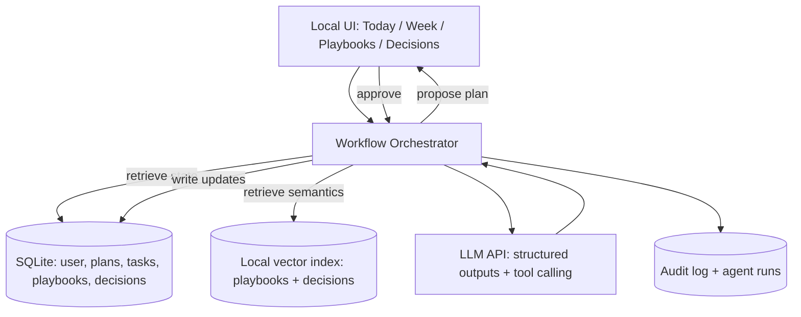

# Neurodivergent‑First Agentic Scaffolding App Design  
*(Local‑first MVP that preserves the original “scaffolded cadence + playbooks + sequencing” core while explicitly supporting ADHD, AuDHD, and related executive‑function differences.)*

## Executive summary

This report proposes a **generic, neurodivergent‑first “agentic scaffolding” app** that functions as an *external executive‑function layer*: it converts a user’s high‑level intent (vision) into **sequenced, time‑boxed next steps**, preserves decision context, and instantiates repeatable ops as **playbooks**. The MVP is **local‑first** (data stored on-device) with an agent that uses **Plan‑and‑Solve + guarded tool calls + structured outputs** to reliably update the user’s plan and tasks rather than “chatting freely.” The design is grounded in evidence on ADHD/autism executive‑function differences, task‑switching/interruptions, and choice overload, and incorporates official accessibility guidance for cognitive and learning differences. citeturn0search0turn3search4turn0search3turn4search2turn1search0turn1search1turn1search2

Key design takeaways:

- **Minimize working‑memory load** by keeping “Now / Next / Later” visible and by storing decisions, steps, and templates externally (users should not have to remember what they decided yesterday). Executive-function differences in ADHD and autism are robust at the group level, though heterogeneous within individuals—product value comes from *scaffold options and defaults*, not one rigid system. citeturn0search0turn5search4turn5search16turn3search4  
- **Reduce decision paralysis by constraint + defaults** (limited choices, “good‑enough” presets, reversible decisions). Classic choice‑overload evidence shows that fewer options can increase follow‑through and satisfaction in some contexts. citeturn1search0turn1search8  
- **Protect deep work by batching and notification hygiene**: interruptions produce re‑orientation costs and can increase stress; task-switching costs persist even when people have time to prepare. citeturn0search3turn4search2  
- **Use if‑then planning** to reduce initiation friction (convert intentions into triggers and first actions). This aligns with implementation‑intention evidence for improving goal pursuit, especially when “getting started” is the bottleneck. citeturn4search5turn4search9  
- **Agentic AI helps most when constrained**: use structured outputs and tool calling for deterministic state updates; enforce **human approval gates** for any side effects. citeturn2search0turn2search1turn2search2  

## Evidence synthesis and prioritized product implications

This section summarizes research relevant to ADHD, AuDHD (co‑occurring autism + ADHD), and executive‑function differences, then translates it into **prioritized design implications**.

**Executive‑function traits in ADHD and heterogeneity**  
Meta-analytic evidence supports **moderate, reliable group differences** between ADHD and non‑ADHD groups across many executive‑function tasks, but also emphasizes that deficits are **not universal** across individuals (i.e., overlap exists; subgroup effects are common). This matters for product design: the app should support *multiple scaffolding styles* and avoid one “correct” workflow. citeturn0search0turn5search16turn5search4turn5search8  
Working memory impairments in ADHD have also been supported meta‑analytically, with differentiated effects across verbal vs spatial/central‑executive components; at the same time, researchers debate prevalence estimates and emphasize within‑group heterogeneity. citeturn5search9turn5search1turn5search4  

**Time perception and timing differences (“time blindness”)**  
Recent meta-analysis work reports a measurable **time‑perception deficit** in ADHD across the lifespan, with moderators that include age and working memory. This supports product features that externalize time, reduce reliance on internal timing, and default to timeboxing. citeturn0search2turn0search6  

**Motivational pathways and delay aversion**  
ADHD models include a motivational/delay pathway, where **delay aversion/choice impulsivity** and executive processes interact. Product implication: “motivation” features should be reframed as **shorter feedback loops**, immediate next steps, and reduced waiting/uncertainty—rather than punitive reminders. citeturn3search7turn3search11turn3search3  

**Autism and executive function, cognitive flexibility, intolerance of uncertainty, sensory differences**  
Large meta-analyses support broad executive-function differences in autism (e.g., working memory/control/flexibility), with stability across development and variability by task. Separate meta-analyses examine working memory and cognitive flexibility specifically. citeturn3search4turn3search0turn3search8  
A systematic review/meta-analysis links **intolerance of uncertainty** and anxiety in autism, reinforcing the value of predictable, explicit workflows and “what happens next” clarity. citeturn3search2turn3search14  
Sensory processing symptoms in autism are also meta‑analytically supported (over‑responsivity, under‑responsivity, seeking), with heterogeneity—implying the UI must allow sensory customization (visual density, motion, sound, notification intensity). citeturn4search0turn4search12  

**AuDHD and co‑occurrence (why “neurodivergent‑first” must be multi‑profile)**  
Co‑occurrence between autism and ADHD is well documented, with reviews and meta‑analyses reporting substantial overlap in both directions. Product implication: preference conflicts are expected (e.g., ADHD novelty seeking vs autism predictability needs), so the app must make personalization first‑class and avoid “one tone fits all.” citeturn0search13turn0search9  

**Task switching, interruptions, and choice overload**  
Task-switching experiments show **residual switch costs** that persist even with preparation time—supporting strong “protect focus” defaults and batching. citeturn0search3turn0search15  
Field/lab work on interruptions shows people may work faster after interruptions but experience higher stress, frustration, effort, and time pressure—supporting “notification hygiene,” digest modes, and quick re‑entry cues. citeturn4search2turn4search6  
Choice overload experiments demonstrate that larger assortments can reduce conversion and satisfaction in some settings—supporting default presets and limited choice sets in planning flows (e.g., “pick 1 of 3” instead of “choose any of 20”). citeturn1search0turn1search8  

**Prioritized design implications (ranked)**  
1) **Externalize executive function**: persistent “Today is for…”, “Next tiny step”, visible status, decision memory, and templates. citeturn0search0turn3search4turn1search1  
2) **Constrain choices and time**: rule‑of‑3, defaults, timeboxing, and pre‑committed routines to reduce paralysis. citeturn1search0turn0search2turn1search1  
3) **Protect attention**: batching, interrupt controls, and “resume context” summaries after any switch. citeturn0search3turn4search2turn1search1  
4) **Predictability + sensory control**: consistent flows, low visual density by default, optional sensory features, and error‑tolerant undo. citeturn1search1turn1search2turn4search0  
5) **Initiation scaffolds**: if‑then triggers, “starter steps,” and immediate feedback loops. citeturn4search5turn3search7  

## Revised product vision and core principles

**Product vision**  
A **neurodivergent‑first scaffolding OS** that turns “vague intention + constraints” into **sequenced, doable steps** with predictable routines. The agent’s job is not to generate endless ideas—it is to **structure**, **prioritize**, **limit**, and **remember** on the user’s behalf.

**Core principles (neurodivergent‑first by design)**  
- **Scaffolding, not judgment**: the system assumes variability in attention/energy and supports resets without shame. (This aligns with the reality of heterogeneity in ADHD/autism EF profiles.) citeturn5search4turn3search4  
- **Low‑friction defaults**: no blank‑page planning; everything starts from templates and “good‑enough” presets to avoid choice overload and decision paralysis. citeturn1search0turn1search8  
- **Predictable workflows**: the UI and agent responses follow consistent patterns (same steps, same labels, same confirmation gates), consistent with cognitive accessibility guidance emphasizing predictability and reduced cognitive burden. citeturn1search1turn1search2turn1search17  
- **Externalize time + re‑entry**: every task has a proposed time box; every switch has a “last state + next action” resume card, reflecting evidence on time perception differences in ADHD and interruption/switch costs. citeturn0search2turn4search2turn0search3  
- **Sensory and accessibility controls are first‑class**: adjustable visual density, animation/motion, sounds, notification intensity, and language tone; sensory variability is common in autism with heterogeneous profiles. citeturn4search0turn1search1turn1search2  
- **Error‑tolerant, reversible interactions**: undo, versioning, “soft delete,” and “safe mode.” Cognitive accessibility guidance strongly emphasizes reducing mistakes and supporting recovery. citeturn1search1turn1search2turn1search18  

## Feature set mapped to the original challenge areas with user stories

The following MVP feature set preserves the prior scaffolding core (vision → sequential execution; ops playbooks; daily/weekly cadence) and adapts it for neurodivergent cognition.

| Original challenge | MVP feature | Short user story (ADHD/AuDHD-first) | What the agent does |
|---|---|---|---|
| Vision → sequential execution | **Sequencer flow**: “Intent → outcome → 3 steps → next 10 minutes” + timebox | “As a user, when I know what I want but can’t start, I want the app to turn it into the smallest next action in under a minute.” citeturn0search0turn0search2turn1search1 | Plan‑and‑Solve produces a structured plan; proposes next action + estimate; writes it into Today plan. citeturn2search0turn4search5 |
| Ops‑from‑scratch | **Playbooks library** (shipping, customer disputes, event prep, marketing batch) | “As a user, I want repeatable checklists and templates so I don’t rebuild processes from scratch each time.” citeturn0search0turn1search1 | Instantiates a playbook into a checklist; drafts messages/templates; records completion patterns for reuse. |
| Decision paralysis | **Decision Clinic**: “pick from 3 defaults” + reversible decision record | “As a user, I want to stop researching endlessly and choose a ‘good enough for now’ option with a clear rationale and rollback plan.” citeturn1search0turn1search8turn3search14 | Constrains options; produces a decision record; schedules a review date. |
| Cognitive switching costs | **Switch guardrails**: batching blocks + resume cards + capture inbox | “As a user, I want to capture interruptions quickly and return to what I was doing without losing the thread.” citeturn4search2turn0search3turn1search1 | Creates a “resume card” (context + next action); routes captured items to inbox with tags. |
| Playbooks + “if/then” resilience | **If‑Then rules** for triggers (e.g., ‘If I get a dispute email → run dispute playbook’) | “As a user, I want automatic prompts when predictable situations happen, so I don’t rely on memory or willpower.” citeturn4search5turn4search9 | Converts user intent into triggers; when triggered, proposes next actions and drafts. |
| Daily/weekly cadence | **Cadence engine**: Monthly goal → weekly milestones → 3 weekly objectives → 3 daily non‑negotiables | “As a user, I want a consistent planning rhythm that limits how much I juggle and keeps me aligned.” citeturn1search1turn0search3turn1search0 | Auto-runs weekly planning and daily planning in the same format; enforces rule‑of‑3 constraints. |

**What makes this neurodivergent‑first (not just “a planner”)**  
- Every flow ends with a **single next action** (not a long list).  
- The UI supports **“return to task”** after any interruption.  
- Defaults are strong; optionality is hidden behind “More options.”  
- The app records “what worked” and offers it again (reducing decision load over time). citeturn1search0turn4search2turn5search4  

## Agent architecture, memory schema, and data model

### Agent behavior model

Use a **workflow-first, agent-second** design: most behaviors are predictable workflows; the model fills structured schemas and requests tools only when needed. This improves reliability and reduces security risk. Tool calls and structured outputs should be treated as **product infrastructure**, not “nice-to-have.” citeturn2search0turn2search1turn2search5  

**Core loop (Plan‑and‑Solve + guardrails)**  
1) **Parse request + constraints** (time available, energy, sensory mode, current milestone).  
2) **Output a Plan object** (structured JSON) containing: focus sentence, 3 non‑negotiables, next actions, timeboxes, and any playbook instantiations. citeturn2search0turn4search5  
3) **Human approval gate**: user sees a review UI (“Approve / Edit / Ask again”) before any writes.  
4) **Guarded tool calls** write to local DB; side effects (email send, publish, calendar changes) remain disabled in MVP or require explicit confirmation.  
5) **Audit + recovery**: store an “agent_run” record and allow undo/version rollback. (Prompt injection and insecure output handling are top risks; guardrails and auditing are standard mitigations.) citeturn2search2turn2search10turn1search3turn2search3  

### Architecture diagram (local-first)



The “LLM API” node can be remote inference while still keeping *data local-first* (store only what you need; optionally redact sensitive text before sending). Any move toward automated “actions” should follow risk management guidance (threat modeling, logging, controls), consistent with entity["organization","National Institute of Standards and Technology","us standards agency"] AI RMF/GenAI profile guidance. citeturn2search3turn1search3turn2search11  

### Security and safety guardrails (MVP-grade, but real)

Because prompt injection is a top LLM app risk category, treat **all user-provided content** (emails, notes, web text) as untrusted and keep tools least-privileged. entity["organization","OWASP","appsec nonprofit"] identifies prompt injection and insecure output handling among core LLM risks. citeturn2search2turn2search6turn2search10  

Minimum controls for MVP:
- **Schema-validated outputs only** for state updates. citeturn2search0turn2search4  
- **Tool allowlists** per workflow (planner can create tasks; playbook runner can instantiate checklists; nothing can “send” externally). citeturn2search1turn2search5  
- **Human approvals** before committing changes; per-field diff preview for edits.  
- **Audit tables** with timestamped deltas for undo and debugging. citeturn1search3turn2search3  

### Simple data model (tables / schemas)

A practical MVP data model that supports cadence + playbooks + decisions + agent auditing:

| Table | Purpose | Key fields (illustrative) |
|---|---|---|
| `user_profile` | Preferences + sensory settings | `id`, `display_density`, `tone_style`, `notification_mode`, `default_timebox_minutes`, `energy_scale_labels`, `created_at` citeturn1search1turn4search0 |
| `monthly_goal` | Monthly “north star” | `id`, `month`, `goal_text`, `success_definition`, `created_at` |
| `weekly_milestone` | Weekly deliverables | `id`, `goal_id`, `week_start`, `deliverable_text`, `risk_notes` |
| `weekly_objective` | “Rule of 3” objectives | `id`, `milestone_id`, `title`, `priority_rank (1–3)` |
| `daily_plan` | Daily focus + 3 non‑negotiables | `id`, `date`, `focus_sentence`, `energy_level`, `created_at` |
| `task` | Executable steps | `id`, `daily_plan_id`, `objective_id`, `next_action`, `timebox`, `status`, `sort_order` citeturn0search2turn1search0 |
| `playbook` | Reusable ops workflows | `id`, `name`, `trigger_type`, `steps_json`, `templates_json`, `version`, `updated_at` |
| `playbook_run` | Instantiated checklist for a situation | `id`, `playbook_id`, `context`, `created_at`, `status` |
| `decision_record` | Prevent re-deciding endlessly | `id`, `question`, `options_json`, `decision`, `rationale`, `review_date`, `created_at` citeturn1search0turn3search14 |
| `capture_inbox` | Quick capture to reduce switching | `id`, `text`, `source`, `triage_status`, `created_at` citeturn4search2turn1search1 |
| `agent_run` | Traceability + debugging | `id`, `workflow_name`, `input_summary`, `output_json`, `approved`, `latency_ms`, `created_at` citeturn2search2turn2search0 |
| `audit_event` | Undo + change history | `id`, `entity_type`, `entity_id`, `diff_json`, `created_at` citeturn1search2turn1search1 |

## Local-first MVP stack, folder layout, setup steps, and local vs hosted trade-offs

### Local-first MVP tech stack (VS Code / Cursor friendly)

**Goal:** simplest thing that supports a reliable workflow engine and a clear UI.

- Backend: Python 3.11 + FastAPI + Pydantic (schema validation) + SQLite.  
- Agent/orchestrator: a small workflow runner (your code) that calls the LLM for **structured plan outputs**, then applies updates via tool functions. citeturn2search0turn2search1  
- Local semantic retrieval: lightweight local embeddings index (initially even “SQLite + full-text search” can be enough; upgrade later).  
- UI: local web UI (React/Vite or a minimal server-rendered UI) focusing on “Today” and “Week.”  
- Observability: local logs + `agent_run`/`audit_event` tables.

If using entity["organization","OpenAI","ai research company"] APIs: rely on Function Calling and Structured Outputs for correctness and stable agent-to-app integration. citeturn2search1turn2search0  

### Folder layout (minimal, workflow-first)

```
scaffold-app/
  app/
    main.py                 # FastAPI entry
    workflows/
      daily_plan.py
      weekly_plan.py
      playbook_run.py
      decision_clinic.py
      inbox_triage.py
    agent/
      llm_client.py         # structured outputs + tool calling adapter
      schemas.py            # Pydantic models for Plan, Task, DecisionRecord
      tools.py              # pure functions: create_task, update_plan, etc.
    storage/
      db.py                 # SQLite connection + migrations
      models.sql            # schema
      retrieval.py          # local search / embeddings (optional)
    ui/                     # local web UI (or templates)
  scripts/
    install.sh
    run.sh
  .env.example
  requirements.txt
  README.md
```

### Setup steps for a non-technical user (local laptop)

Make this a copy/paste README with “Option A (easy) / Option B (advanced).” For MVP, assume “Option A.”

**Option A: one-time install, then double-click run**
1) Install Python 3.11+ (one-time).  
2) Download the project folder (zip) and unzip it.  
3) Double-click `install` script (or run the commands below once).  
4) Double-click `run` script; the app opens in the browser at `http://127.0.0.1:8000`.

**Minimal CLI snippet (cross-platform friendly)**

```bash
# inside the project folder
python -m venv .venv

# macOS/Linux
source .venv/bin/activate

# Windows (PowerShell)
# .venv\Scripts\Activate.ps1

pip install -r requirements.txt
cp .env.example .env

python -m app.main
```

### Trade-off table: local-only vs hosted

| Dimension | Local-only (true local-first) | Hosted (web app) |
|---|---|---|
| Privacy & data control | Strongest: data stays on device by default | Requires clear data policies; higher breach surface citeturn2search2turn2search10 |
| Offline use | Works offline (except remote LLM calls) | Usually requires internet |
| Latency | Very fast UI + DB; LLM depends on provider | Depends on hosting + network |
| Multi-device continuity | Hard without sync | Natural (login + cloud DB) |
| Integrations (calendar/email) | Possible, but setup can be harder per device | Easier central integrations + webhooks |
| Maintenance & updates | You must manage local updates | Centralized deploys; easier updates |
| Cost model | Minimal hosting cost; still API cost if remote LLM | Hosting + DB + monitoring + API cost |
| User setup friction | Higher initially (install/run) | Lower (just login) |
| Compliance posture | Simpler if no data leaves device | More formal security/compliance needed (risk mgmt, audits) citeturn2search3turn1search3turn2search2 |

**Pragmatic recommendation:** start **local-first MVP**, then add an optional hosted mode only when the team validates the need for multi-device, push notifications, or deep integrations.

## Accessibility and neurodivergent UX guidelines

This section uses official cognitive accessibility guidance as the baseline, then adds ADHD/AuDHD-specific interaction heuristics.

### Baseline standards to align with
entity["organization","World Wide Web Consortium","web standards body"] guidance on making content usable for cognitive and learning disabilities emphasizes reducing cognitive load, improving predictability, and supporting error recovery. WCAG 2.2 includes success criteria relevant to cognitive accessibility (e.g., predictable behavior, error prevention, and “accessible authentication” patterns that reduce reliance on memory). citeturn1search1turn1search2turn1search18turn1search5  

### Practical UX rules for ADHD/AuDHD-first scaffolding

**Visual density + structure**
- Default to **low-density screens**: one focus sentence + three items + one “capture” box. (Cognitive guidance repeatedly stresses simplification and chunking.) citeturn1search1turn1search17  
- Offer density modes: “Calm,” “Standard,” “Power-user,” stored in `user_profile`. Sensory heterogeneity in autism supports making this user-controlled. citeturn4search0turn3search4  

**Timing and initiation**
- Every task shows **a suggested timebox** and a “start in 10 minutes” micro-step, supporting externalization of time and reduced initiation load. citeturn0search2turn4search5  
- Use if‑then rules to reduce “remembering to start,” consistent with implementation intention evidence. citeturn4search5turn4search9  

**Microcopy and tone**
- Use “neutral + supportive” language; avoid shame-based alerts.  
- Use direct, concrete verbs (“Open shipping spreadsheet,” “Print labels,” “Draft reply”) rather than abstract (“Work on shipping”).  
- Always end agent responses with **one recommended next action** (and a “not now” option).

**Interruptions and notifications**
- Default notifications to **digest mode** and avoid real-time pings unless the user explicitly opts-in, because interruptions increase stress/time pressure and task-switching costs are real. citeturn4search2turn0search3turn4search22  
- Provide **resume cards** after any navigation away from “Today” (last context + next action) to reduce reorientation costs. citeturn4search2turn0search3  

**Error tolerance**
- “Undo” should be visible and immediate; any agent write produces a diff preview and a rollback path (aligned with cognitive accessibility emphasis on preventing and correcting mistakes). citeturn1search1turn1search2turn1search18  

**Sensory options**
- Motion/animation toggle, sound toggle, high-contrast toggle, and “low stimulation” theme. Sensory symptom meta-analyses support treating this as a core requirement, not a preference. citeturn4search0turn4search12  

## Roadmap, success metrics, and open questions

### Prioritized implementation roadmap (4–6 sprints)

Assume 2-week sprints; aim for **five sprints** that each ship a usable slice.

| Sprint | MVP milestone | What ships |
|---|---|---|
| Sprint A | **Foundations** | SQLite schema + migrations; Today screen skeleton; capture inbox; audit log; minimal settings (density/tone/notifications). citeturn1search1turn1search2 |
| Sprint B | **Cadence engine** | Monthly goal + weekly milestones + weekly objectives + daily plans; rule-of-3 enforcement; timebox fields; manual task completion. citeturn1search0turn0search2 |
| Sprint C | **Agent planning (safe mode)** | Plan-and-Solve daily plan generator using structured outputs; preview/approve UI; no external side effects; agent_run logging. citeturn2search0turn2search1turn2search2 |
| Sprint D | **Playbooks** | Create/edit playbooks; instantiate playbook runs; templated checklists; “if‑then trigger” builder (manual triggers first). citeturn4search5turn1search1 |
| Sprint E | **Decision Clinic + switch supports** | Decision records with review dates; resume cards; batching block suggestions; digest notification logic and do-not-disturb modes. citeturn1search0turn4search2turn0search3 |

### Measurable success metrics (MVP-grade, behavior-focused)

Track these locally (privacy-preserving) and optionally export for user review:

- **Planning friction:** median time from “open app” → “approved daily plan.”  
- **Follow-through:** % days with ≥1 non‑negotiable completed; median completions/day.  
- **Switch cost proxy:** number of “resume card” uses/day; % successful return within 60 seconds. citeturn4search2turn0search3  
- **Decision reuse:** number of repeated decisions avoided (decision record referenced vs re-decided). citeturn1search0  
- **User-reported load:** weekly 1–5 rating: “I know what to do next” and “My plan felt doable.”  

### Open questions to resolve before coding

These determine whether you build “a planner,” “an ops engine,” or “a real assistant,” and how much automation is safe.

- **User constraints:** typical available hours, energy patterns, sensory preferences, and whether timeboxing or body-doubling timers are welcome. citeturn0search2turn4search0  
- **Device targets:** Mac/Windows? Mobile companion needed later?  
- **Data sensitivity:** customer PII, financial data, health info; what must never leave device? (This affects whether remote LLM calls are allowed and what redaction is required.) citeturn2search3turn1search3turn2search2  
- **Integrations (phase 1 vs later):** calendar, email, storefront tools; and what “read vs write” permissions are acceptable.  
- **Allowed automations:** what can be automated without confirmation (e.g., create tasks) vs only with explicit approval (send messages, publish content). citeturn2search2turn2search10  
- **Personalization defaults:** how strict is rule-of-3; what happens when the user adds a 4th priority; default notification modes; default visual density. citeturn1search0turn1search1  
- **Onboarding flow:** do you start with (a) “Today” only, (b) a weekly plan wizard, or (c) a short intake that sets constraints and sensory preferences first? citeturn1search1turn1search17  
- **Local-only vs hosted intent:** is multi-device a must-have in 90 days, or can it wait? (Use the trade-off table above to decide.)  
- **Evaluation strategy:** what “good” looks like for the agent—do you want deterministic “template fill” or more open-ended coaching? (This affects schema strictness and test coverage.) citeturn2search0turn2search12